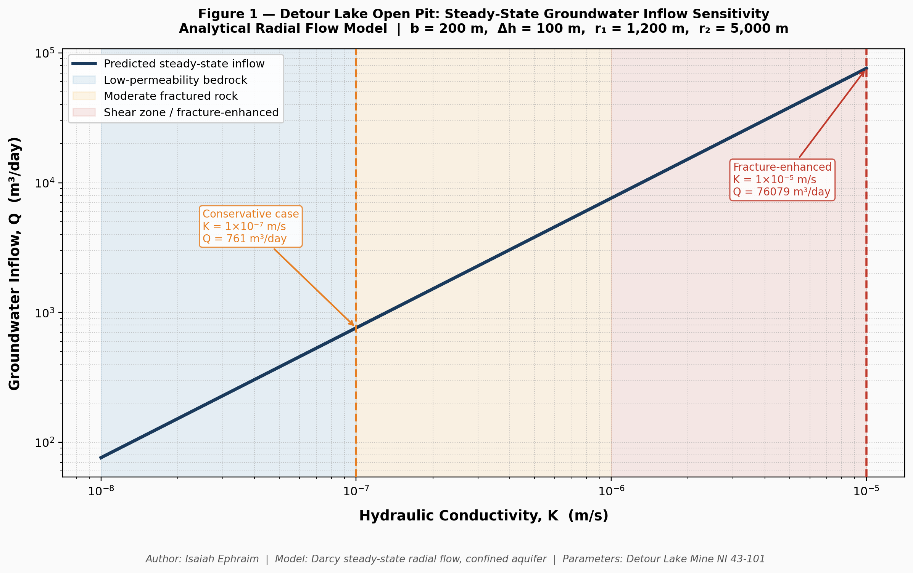

# Detour Lake Open Pit — Steady-State Groundwater Inflow Model

**Author:** Isaiah Ephraim  
**Affiliation:** B.Eng Mining Engineering, Federal University of Technology Akure, Nigeria  
**Contact:** isaiahephraim04@gmail.com  
**Profile:** [Academia.edu](https://futa.academia.edu/IsaiahEphraim) | [LinkedIn](https://linkedin.com/in/isaiahephraim) | [GitHub](https://github.com/ephraim04)

---

## Overview

This repository contains the full analytical groundwater inflow model for the Detour Lake open pit gold mine in Northern Ontario, Canada. The study applies the **Thiem equation for steady-state confined radial flow** to estimate groundwater inflow across the reported fractured bedrock hydraulic conductivity range derived from NI 43-101 technical disclosures.

The work was conducted independently to demonstrate applied mine hydrogeology modelling capability using only publicly available site data and open-source Python tools.

---

## Research Question

How sensitive is steady-state groundwater inflow to hydraulic conductivity variation in a large open pit mine hosted in fractured Archean greenstone bedrock?

---

## Key Results

| Scenario | Hydraulic Conductivity K (m/s) | Predicted Inflow Q (m³/day) |
|---|---|---|
| Conservative bedrock | 1 × 10⁻⁷ | ~761 |
| Fracture-enhanced (shear zone) | 1 × 10⁻⁵ | ~76,079 |

A two-order-of-magnitude increase in K produces a two-order-of-magnitude increase in Q — directly from the linear structure of the Thiem equation. Structurally controlled shear zone permeability is the dominant control on dewatering demand at this site.

---

## Governing Equation

The Thiem equation for steady-state inflow to a fully penetrating circular excavation in a confined aquifer:

```
Q = (2π · K · b · (h₂ - h₁)) / ln(r₂ / r₁)
```

**Where:**
- `Q` = Groundwater inflow (m³/s)
- `K` = Hydraulic conductivity (m/s)
- `b` = Saturated aquifer thickness (m)
- `h₂ - h₁` = Hydraulic head difference (m)
- `r₁` = Pit radius (m)
- `r₂` = Radius of influence (m)

---

## Model Parameters — Detour Lake Mine

| Parameter | Value | Source |
|---|---|---|
| Pit radius (r₁) | 1,200 m | Detour Gold Corporation (2018) |
| Radius of influence (r₂) | 5,000 m | Assumed regional boundary |
| Saturated thickness (b) | 200 m | Detour Gold Corporation (2018) |
| Head difference (h₂ − h₁) | 100 m | Representative depressurisation |
| Bedrock K range | 10⁻⁸ to 10⁻⁵ m/s | Detour Gold Corporation (2018) |

---

## Repository Contents

```
detour-lake-inflow-model/
│
├── README.md                                 <- This file
├── detour_lake_inflow_model.py               <- Python model and sensitivity analysis
├── figures/
│   └── detour_lake_inflow_sensitivity.png    <- Sensitivity plot (Figure 1)
└── paper/
    └── detour_lake_inflow_study_FINAL.docx   <- Full technical paper with references
```

---

## Sensitivity Analysis

Hydraulic conductivity was varied across the full reported bedrock range
(K = 10⁻⁸ to 10⁻⁵ m/s) with all other parameters held constant.



*Figure 1. Predicted steady-state groundwater inflow as a function of hydraulic conductivity. Shaded zones identify permeability domains. Dashed lines mark the two reference scenarios.*

---

## How to Run

**Requirements:**
```
Python 3.x
numpy
matplotlib
```

**Install dependencies:**
```bash
pip install numpy matplotlib
```

**Run the model:**
```bash
python detour_lake_inflow_model.py
```

This will:
1. Calculate inflow across the full K range
2. Print the two reference scenario results to the terminal
3. Save the sensitivity plot as `detour_lake_inflow_sensitivity.png`

---

## Model Assumptions and Limitations

**Assumptions:**
- Steady-state groundwater conditions
- Radial symmetry of flow toward the pit
- Homogeneous and isotropic hydraulic conductivity
- Fully penetrating pit geometry
- Constant hydraulic head at the radius of influence

**Limitations:**
- Fracture anisotropy is simplified into an equivalent homogeneous K
- Transient drawdown during progressive pit deepening is not modelled
- Dewatering wells and staged pit development are not simulated
- Surface water-groundwater interactions are excluded

Despite these simplifications, predicted inflow magnitudes are consistent with reported operational dewatering scales at the Detour Lake site, supporting the use of this approach for preliminary mine water management assessment.

---

## References

1. Freeze, R.A. and Cherry, J.A., 1979. *Groundwater*. Englewood Cliffs, New Jersey: Prentice-Hall.

2. Thiem, G., 1906. *Hydrologische Methoden*. Leipzig: Gebhardt.

3. Detour Gold Corporation, 2018. *Detour Lake Operation, Ontario, Canada: NI 43-101 Technical Report*. Effective date: 27 June 2018. Report date: 26 November 2018.

4. Agnico Eagle Mines Limited, 2024. Detour Lake Mine operations overview. Available at: https://www.agnicoeagle.com [Accessed: March 2026].

5. Todd, D.K. and Mays, L.W., 2005. *Groundwater Hydrology*. 3rd ed. Hoboken, New Jersey: John Wiley & Sons.

6. Thurston, P.C., 2002. Autochthonous development of Superior Province greenstone belts. *Precambrian Research*, 115(1-4), pp. 11-36.

---

## Academic Profile

This study is part of an independent research portfolio developed to demonstrate applied mine hydrogeology modelling capability. The full paper is available on Academia.edu:

[https://futa.academia.edu/IsaiahEphraim](https://futa.academia.edu/IsaiahEphraim)

---

*This repository is maintained by Isaiah Ephraim. Feedback and questions are welcome via email or GitHub Issues.*
